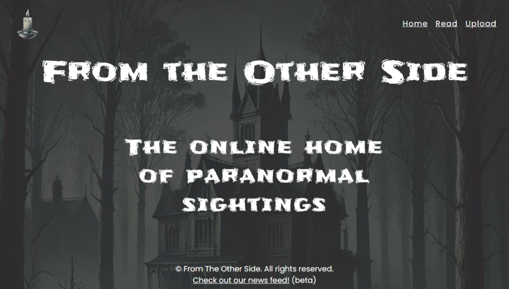

# Paranormal Sightings App

## Features

- Share your own paranormal encounter stories
- Explore ghost sightings and experiences from around the world
- Browse user-submitted reports and details
- User-friendly interface built with React


## Live Demo

🔗 **Live preview:** https://paranormal-sightings-frontend.vercel.app/


## Snapshot




## Tech Stack

Here are the main technologies used in this project:

* **React** – Front-end UI framework
* **JavaScript (ES6+)** – App logic
* **CSS** – Styling 
* **Node / Express / API backend** 
* **Database (MongoDB)**


## Installation

1. **Clone the repository**

```bash
git clone https://github.com/regnernacua/Paranormal-Sightings-App.git
```

2. **Navigate into the project directory**

```bash
cd Paranormal-Sightings-App
```

3. **Install dependencies**

```bash
npm install
```

4. **Start the development server**

```bash
npm start
```

Your app should now be running at `http://localhost:3000`.


## Usage

1. Visit the home page
2. Browse shared sightings
3. Add your own paranormal story
4. Click a report card to view details

## License

Distributed under the **MIT License**. See `LICENSE` for more information.


## Contact

Regner Nacua – *[nacua.regner@gmail.com](mailto:nacua.regner@gmail.com)*

```
